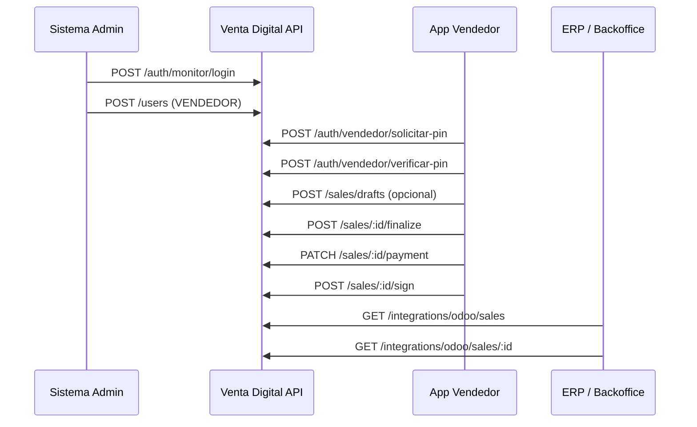

# Manual de integración API — Venta Digital

Documento para que **otra empresa o sistema externo** pueda:

1. Dar de alta **vendedores**
2. **Capturar y completar ventas** en nombre de esos vendedores
3. **Consultar ventas y archivos** (documentos adjuntos)

---

## 1. Información general

| Concepto | Valor |
|----------|--------|
| Base URL | `https://<host>/api` |
| Formato | JSON (`Content-Type: application/json`) |
| Codificación documentos | Base64 en requests/responses |
| Idioma errores | Español (`message` en cuerpo de error) |
| Folio de venta | Es el `id` numérico de la venta |

### Estados de una venta

```
DRAFT → PENDING_PAYMENT → PENDING_SIGNATURE → COMPLETED
```

| Estado | Significado |
|--------|-------------|
| `DRAFT` | Borrador (máx. 3 por vendedor, caduca en 24 h) |
| `PENDING_PAYMENT` | Captura lista; falta registrar pago |
| `PENDING_SIGNATURE` | Pago registrado; falta firma del titular |
| `COMPLETED` | Venta firmada; documentos en Google Drive |

---

## 2. Modelos de integración

Hay **tres formas** de integrarse con lo que existe hoy. Elijan según el rol del sistema externo.

### Modelo A — Administración de vendedores (JWT ADMIN)

Para la empresa que **crea y gestiona cuentas de vendedor**.

- Autenticación: `POST /auth/monitor/login` con usuario **ADMIN**
- Endpoints: `/users/*`
- El vendedor recibe PIN por WhatsApp al vender (Modelo B)

### Modelo B — Operación de venta (JWT VENDEDOR)

Para la app o portal donde el **vendedor captura, cobra y firma**.

- Autenticación: PIN WhatsApp (`/auth/vendedor/*`)
- Endpoints: `/sales/*`
- Token JWT vence al **fin del día** (zona `America/Mexico_City`)
- **Sin refresh token**

### Modelo C — Consulta centralizada (API Key)

Para un **ERP, backoffice o data warehouse** que lee ventas y descarga adjuntos.

- Autenticación: header `X-Api-Key: <ODOO_API_KEY>`
- Endpoints: `/integrations/odoo/*`
- GSM debe entregar la clave y URL del servidor
- Incluye **base64 de todos los documentos** al consultar detalle

> **Nota:** No existe hoy un endpoint público para “crear venta” sin JWT de vendedor.  
> La empresa integradora debe: **(A)** crear vendedores → **(B)** operar ventas con su sesión, o implementar a futuro un API Key de escritura si GSM lo habilita.

---

## 3. Autenticación

### 3.1 Header común (JWT)

```http
Authorization: Bearer <accessToken>
```

### 3.2 Alta de vendedor — flujo previo (Modelo A)

**Paso 1 — Login admin**

```http
POST /api/auth/monitor/login
```

```json
{
  "username": "admin.integrador",
  "password": "********"
}
```

**Respuesta 200**

```json
{
  "accessToken": "eyJhbGciOiJIUzI1NiIs...",
  "refreshToken": "eyJhbGciOiJIUzI1NiIs...",
  "expiresAt": "2026-08-11T05:59:59.999Z",
  "user": {
    "id": 1,
    "fullName": "Administrador",
    "type": "ADMIN",
    "permissions": ["usuarios.gestionar", "ventas.ver", "..."]
  }
}
```

**Paso 2 — Crear vendedor** → ver [sección 4](#4-gestión-de-vendedores-admin)

### 3.3 Sesión vendedor — PIN WhatsApp (Modelo B)

**Paso 1 — Solicitar PIN**

```http
POST /api/auth/vendedor/solicitar-pin
```

```json
{
  "cellphone": "6671234567"
}
```

| Campo | Tipo | Reglas |
|-------|------|--------|
| `cellphone` | string | 10 dígitos, celular registrado y activo |

**Respuesta 200**

```json
{
  "nipId": 12345,
  "message": "PIN enviado por WhatsApp"
}
```

**Paso 2 — Verificar PIN**

```http
POST /api/auth/vendedor/verificar-pin
```

```json
{
  "nipId": 12345,
  "nip": "482910",
  "cellphone": "6671234567"
}
```

**Respuesta 200**

```json
{
  "accessToken": "eyJhbGciOiJIUzI1NiIs...",
  "expiresAt": "2026-08-11T05:59:59.999Z",
  "user": {
    "id": 42,
    "fullName": "Juan Pérez Vendedor",
    "type": "VENDEDOR",
    "permissions": []
  }
}
```

### 3.4 API Key — integración M2M (Modelo C)

```http
X-Api-Key: <valor de ODOO_API_KEY en el servidor>
```

Alternativa:

```http
Authorization: ApiKey <valor>
```

---

## 4. Gestión de vendedores (ADMIN)

Requiere: `Authorization: Bearer <adminToken>`  
Rol: `ADMIN` + permiso `usuarios.gestionar`

### 4.1 Crear vendedor

```http
POST /api/users
```

```json
{
  "type": "VENDEDOR",
  "fullName": "María López García",
  "cellphone": "6671234567"
}
```

| Campo | Obligatorio | Descripción |
|-------|-------------|-------------|
| `type` | Sí | `VENDEDOR` |
| `fullName` | Sí | Nombre completo |
| `cellphone` | Sí | 10 dígitos, **único** entre vendedores |

**Respuesta 201**

```json
{
  "id": 42,
  "type": "VENDEDOR",
  "fullName": "María López García",
  "cellphone": "6671234567",
  "username": null,
  "active": true,
  "permissions": [],
  "createdAt": "2026-08-11T17:00:00.000Z",
  "updatedAt": "2026-08-11T17:00:00.000Z"
}
```

### 4.2 Listar vendedores

```http
GET /api/users?type=VENDEDOR
```

### 4.3 Activar / desactivar

```http
PATCH /api/users/42/active
```

```json
{
  "active": false
}
```

### 4.4 Actualizar vendedor

```http
PATCH /api/users/42
```

```json
{
  "fullName": "María López G.",
  "cellphone": "6671234567"
}
```

---

## 5. Ventas — vendedor (JWT VENDEDOR)

Requiere token del vendedor dueño de la venta.

### 5.1 Política de borradores (consulta)

```http
GET /api/settings/drafts
Authorization: Bearer <vendedorToken>
```

**Respuesta**

```json
{
  "draftLimit": 3,
  "draftTtlHours": 24,
  "maxDiscountAmount": 10,
  "descuentoEspecial": 0,
  "allowedDiscountMax": 10
}
```

### 5.2 Listar mis ventas

```http
GET /api/sales/mias
```

**Respuesta**

```json
{
  "scope": "own",
  "total": 2,
  "draftCount": 1,
  "draftLimit": 3,
  "draftTtlHours": 24,
  "items": [ { "...": "SalePublic" } ],
  "drafts": [ { "...": "SalePublic" } ],
  "submitted": [ { "...": "SalePublic" } ],
  "message": "Ventas y borradores del vendedor"
}
```

### 5.3 Detalle de una venta

```http
GET /api/sales/1001
```

**Respuesta — objeto `SalePublic`**

```json
{
  "id": 1001,
  "sellerId": 42,
  "sellerName": "María López García",
  "status": "PENDING_PAYMENT",
  "amount": 45000,
  "titularName": "Pedro Sánchez Ruiz",
  "odooPartnerId": null,
  "odooSaleOrderId": null,
  "draftExpiresAt": null,
  "createdAt": "2026-08-11T16:00:00.000Z",
  "updatedAt": "2026-08-11T16:30:00.000Z",
  "driveFolderUrl": null,
  "driveFolderPath": null,
  "payload": { "...": "ver sección 7" }
}
```

### 5.4 Crear borrador

```http
POST /api/sales/drafts
```

```json
{
  "titularName": "Pedro Sánchez Ruiz",
  "payload": {
    "meta": { "fecha": "2026-08-11", "contrato": "VD-001", "origenVenta": "field_selling" },
    "contacto": {
      "apellidoPaterno": "Sánchez",
      "apellidoMaterno": "Ruiz",
      "nombres": "Pedro",
      "curp": "SARP850101HDFRNN09",
      "celular1": "6677654321"
    },
    "beneficiarios": [
      {
        "apellidoPaterno": "Sánchez",
        "nombres": "Ana",
        "parentesco": "Hija",
        "celular": "6671112233",
        "fechaNacimiento": "2010-05-20"
      }
    ],
    "ubicacionPlan": {
      "planKind": "PLAN_FUTURO",
      "nombrePlan": "Plan Familiar",
      "productId": 123,
      "precioPlan": "45000"
    },
    "pago": {
      "precioPlan": "45000",
      "promocionDescuento": "5",
      "anticipo": "5000",
      "frecuencia": "MENSUAL",
      "plazo": "24"
    },
    "documentos": {
      "ine": {
        "name": "ine-frente.jpg",
        "mime": "image/jpeg",
        "dataBase64": "/9j/4AAQSkZJRg..."
      },
      "comprobanteDomicilio": {
        "name": "comprobante.pdf",
        "mime": "application/pdf",
        "dataBase64": "JVBERi0xLjQK..."
      }
    }
  }
}
```

### 5.5 Actualizar borrador

```http
PATCH /api/sales/1001/draft
```

Mismo cuerpo que crear borrador.

### 5.6 Finalizar captura → `PENDING_PAYMENT`

Desde borrador:

```http
POST /api/sales/1001/finalize
```

Nueva venta (sin borrador previo):

```http
POST /api/sales/finalize
```

**Requisitos al finalizar**

- Al menos un beneficiario con nombre
- CURP válida si se envía
- **INE** y **comprobante de domicilio** en `payload.documentos`
- Descuento dentro del tope del vendedor (o descuento especial activo)

**Respuesta:** `SalePublic` con `status: "PENDING_PAYMENT"`

> Al finalizar, si el descuento supera el tope estándar, se **consume** el descuento especial autorizado al vendedor.

### 5.7 Registrar pago → `PENDING_SIGNATURE`

```http
PATCH /api/sales/1001/payment
```

**Transferencia**

```json
{
  "pago": {
    "formaPago": "TRANSFERENCIA",
    "cuenta": "0123456789",
    "banco": "BBVA México",
    "nombreJefeVentas": "Carlos Mendoza"
  },
  "ticketPdf": {
    "name": "ticket-pago_1001.pdf",
    "mime": "application/pdf",
    "dataBase64": "JVBERi0xLjQK..."
  }
}
```

**Efectivo**

```json
{
  "pago": {
    "formaPago": "EFECTIVO",
    "montoRecibido": "6000",
    "cambio": "1000",
    "nombreJefeVentas": "Carlos Mendoza"
  },
  "ticketPdf": { "...": "opcional" }
}
```

| Forma | Campos obligatorios |
|-------|---------------------|
| `EFECTIVO` | `montoRecibido` ≥ anticipo; no enviar cuenta/banco |
| `TRANSFERENCIA` | `cuenta`, `banco` |
| `CHEQUE` | `banco` |

> El descuento **no se revalida** en este paso (ya quedó fijado al finalizar).

### 5.8 Firmar venta → `COMPLETED`

```http
POST /api/sales/1001/sign
```

```json
{
  "firmaCliente": {
    "name": "firma-cliente.png",
    "mime": "image/png",
    "dataBase64": "iVBORw0KGgo..."
  },
  "caratulaPdf": {
    "name": "1001-Caratula.pdf",
    "mime": "application/pdf",
    "dataBase64": "JVBERi0xLjQK..."
  }
}
```

**Efecto:** sube INE, comprobante, ticket, firma y carátula a **Google Drive**; la venta queda `COMPLETED`.

**Respuesta incluye**

```json
{
  "driveFolderUrl": "https://drive.google.com/drive/folders/...",
  "driveFolderPath": "2026/08-agosto/1001-Pedro Sanchez Ruiz"
}
```

### 5.9 Eliminar borrador

```http
DELETE /api/sales/1001
```

Solo si `status === "DRAFT"`.

---

## 6. Consulta de ventas y archivos (API Key)

Para sistemas externos **sin sesión de vendedor**.

### 6.1 Listado (sin adjuntos)

```http
GET /api/integrations/odoo/sales
X-Api-Key: <clave>
```

**Respuesta**

```json
{
  "scope": "conciliation",
  "total": 150,
  "items": [
    {
      "id": 1001,
      "sellerId": 42,
      "sellerName": "María López García",
      "status": "COMPLETED",
      "titularName": "Pedro Sánchez Ruiz",
      "odooPartnerId": 501,
      "odooSaleOrderId": 9001,
      "contrato": "VD-001",
      "nombrePlan": "Plan Familiar",
      "precioPlan": "45000",
      "promocionDescuento": "5",
      "anticipo": "5000",
      "saldo": "37750",
      "amount": 45000,
      "createdAt": "2026-08-11T16:00:00.000Z",
      "updatedAt": "2026-08-11T18:00:00.000Z"
    }
  ]
}
```

Incluye ventas en `PENDING_PAYMENT`, `PENDING_SIGNATURE` y `COMPLETED`.

### 6.2 Detalle con adjuntos (base64)

```http
GET /api/integrations/odoo/sales/1001
X-Api-Key: <clave>
```

Descarga desde Drive los binarios faltantes (INE, comprobante, carátula, etc.) y los incluye en la respuesta.

**Fragmento `payload.documentos`**

```json
{
  "documentos": {
    "ine": {
      "name": "1001-INE.jpg",
      "mime": "image/jpeg",
      "dataBase64": "/9j/4AAQ...",
      "driveFileId": "1abc...",
      "driveFileUrl": "https://drive.google.com/file/d/..."
    },
    "comprobanteDomicilio": { "...": "..." },
    "firmaCliente": { "...": "..." },
    "ticketPago": { "...": "..." },
    "caratulaPdf": { "...": "..." }
  }
}
```

**Carpeta Drive en raíz de la venta**

```json
{
  "driveFolderUrl": "https://drive.google.com/drive/folders/...",
  "driveFolderPath": "2026/08-agosto/1001-Pedro Sanchez Ruiz"
}
```

### 6.3 Vincular con Odoo (opcional)

```http
PATCH /api/integrations/odoo/sales/1001/partner
```

```json
{ "odooPartnerId": 501 }
```

```http
PATCH /api/integrations/odoo/sales/1001/sale-order
```

```json
{ "odooSaleOrderId": 9001 }
```

---

## 7. Estructura del `payload` de venta

Objeto anidado dentro de `SalePublic.payload`:

| Sección | Clave | Contenido |
|---------|-------|-----------|
| Contrato | `meta` | fecha, contrato, origenVenta, folioSolicitud (= id) |
| Titular | `contacto` | datos personales, domicilio, CURP, celular, correo |
| 2.º contacto | `segundoContacto` | opcional |
| Beneficiarios | `beneficiarios[]` | máx. 2 |
| Plan | `ubicacionPlan` | planKind (`PARQUE` \| `PLAN_FUTURO`), productId, precio, preasignación |
| Financiamiento | `pago` | precio, descuento %, anticipo, plazo, formaPago, efectivo recibido/cambio |
| Declaraciones | `declaraciones` | mercadotecnia, publicidad |
| Archivos | `documentos` | ine, comprobanteDomicilio, firmaCliente, ticketPago, caratulaPdf |

### Adjunto (`SaleAttachment`)

```json
{
  "name": "archivo.pdf",
  "mime": "application/pdf",
  "dataBase64": "<contenido sin prefijo data:...>",
  "driveFileId": "opcional tras firma",
  "driveFileUrl": "opcional tras firma"
}
```

### Ubicación parque (preasignación)

```json
{
  "planKind": "PARQUE",
  "preasignacion": true,
  "parqueFuneral": "Parque Culiacán",
  "seccion": "A",
  "cuadrante": "3",
  "numero": "22",
  "parkId": 1,
  "sectionId": 5,
  "quadrantId": 12,
  "spaceId": 340
}
```

---

## 8. Flujo recomendado para integrador



---

## 9. Errores HTTP habituales

| Código | Situación |
|--------|-----------|
| `400` | Validación (CURP, documentos faltantes, pago incompleto, descuento) |
| `401` | Token expirado, PIN inválido, API Key incorrecta |
| `403` | Vendedor intenta ver venta de otro |
| `404` | Venta o usuario no existe |
| `409` | Celular duplicado, cotización Odoo ya ligada |

**Formato error NestJS**

```json
{
  "statusCode": 400,
  "message": "El descuento no puede exceder 10%",
  "error": "Bad Request"
}
```

---

## 10. Requisitos que GSM debe entregar al integrador

| Entregable | Uso |
|------------|-----|
| URL base (`https://...`) | Todas las llamadas |
| Usuario ADMIN (o credenciales dedicadas) | Crear vendedores |
| `ODOO_API_KEY` | Consultar ventas/adjuntos (Modelo C) |
| Documentación WhatsApp / PIN | Login vendedores (servicio ya configurado en GSM) |
| Límite de descuento y política de borradores | Configurados en `/settings` |

---

## 11. Límites y reglas de negocio

- **Borradores:** máx. 3 activos por vendedor; TTL 24 h (configurable).
- **Descuento:** validado al guardar borrador y al **finalizar**; no al registrar pago.
- **Descuento especial:** un grant activo por vendedor; se marca `APPLIED` al finalizar venta que lo usa.
- **Documentos:** INE + comprobante obligatorios para finalizar; firma + carátula al firmar.
- **Drive:** ruta `AÑO/MES/FOLIO-nombrecliente`; archivos `FOLIO-INE`, `FOLIO-Comprobante`, `FOLIO-Ticket`, `FOLIO-Firma`, `FOLIO-Caratula`.
- **Propiedad:** un vendedor solo accede a sus ventas (`sellerId` del token).

---

## 12. Referencia rápida de endpoints

| Método | Ruta | Auth | Descripción |
|--------|------|------|-------------|
| POST | `/auth/monitor/login` | — | Login ADMIN/MONITOR |
| POST | `/auth/vendedor/solicitar-pin` | — | PIN WhatsApp |
| POST | `/auth/vendedor/verificar-pin` | — | Token vendedor |
| POST | `/users` | ADMIN | Crear vendedor |
| GET | `/users?type=VENDEDOR` | ADMIN | Listar vendedores |
| GET | `/sales/mias` | VENDEDOR | Mis ventas |
| GET | `/sales/:id` | VENDEDOR* | Detalle venta |
| POST | `/sales/drafts` | VENDEDOR | Crear borrador |
| PATCH | `/sales/:id/draft` | VENDEDOR | Actualizar borrador |
| POST | `/sales/:id/finalize` | VENDEDOR | Finalizar captura |
| PATCH | `/sales/:id/payment` | VENDEDOR | Registrar pago |
| POST | `/sales/:id/sign` | VENDEDOR | Firmar + Drive |
| GET | `/integrations/odoo/sales` | API Key | Listado ventas |
| GET | `/integrations/odoo/sales/:id` | API Key | Detalle + archivos |

\* MONITOR/ADMIN con permiso `ventas.ver` también puede `GET /sales/:id`.

---

*Versión del manual: 2026-08-11 — alineado al backend Venta Digital (NestJS `/api`).*
